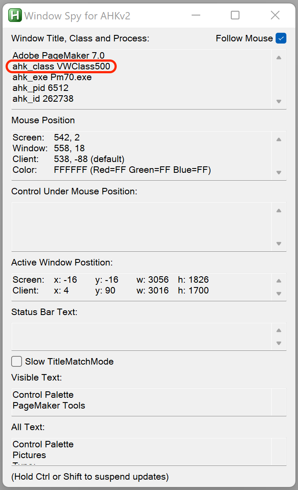

### A.S.H.O.K.
Custom keyboard layout/mapping for Gujarati, Hindi and English diacritic.

Uses AHK hotkeys to remap and link keys.

## Latest Versions

# Hindi - 1.1b
# English - 1.1b
# Gujarati - 1.2b

## Supported Keyboards & Linking

# Hindi
- Typewriter
- DOE
- MP Typewriter

# Gujarati
- Typewriter
- DOE

# English
- Diacritic

## How to Run?
Double click the executable provided by this package.
All scripts start in suspended mode by default i.e. hotstrings will not work when you run the script

# Hindi

Shift+F1        : Activate Hindi script
Control+Alt+F1  : To suspend Hindi script (used from other script)

# Gujarati

Shift+F2        : Activate Gujarati script
Control+Alt+F2  : To suspend Gujarati script (used from other script)

# English

Shift+F3        : Activate English script
Control+Alt+F3  : To suspend English script (used from other script)

*Only one script can be active at a time. If you use shortcuts to activate/deactivate the script then its taken care of automatically.

## Special Notes
+ Turn off Typographer's quote option
+ Turn off auto-correction etc. 

## Configuration
+ Only allowed configuration as of now is to modify the list of programs where the script is active.
+ When the script is executed for the first time, default configuration file is created in 
    `%USERPROFILE%\AppData\Local\{script}_rc.ini`
+ Default ini allows to run script in below programs:
```ini
[AHK_CLASS]
;Pagemaker
VWClass500
;CorelDraw
CorelDRAW
;MS Word
OpusApp
;MS Excel
XLMAIN
;MS Powerpoint
PPTFrameClass
;Fontographer
fogframe
```
+ To add/remove update the `[AHK_CLASS]` section in the configuration file.
+ You can find AHK Class of a program using `Window Spy` program provided by `AHK`. [Click](https://www.autohotkey.com) for official download.


## Building

Project is organized as below:

```javascript
    a.s.h.o.k
    ├─ a.s.h.o.k.{language}/
    │  ├─ {script}.ahk            => This is the main script
    │  ├─ resources
    │  │  ├─ {keyboard}
    │  │  │  ├─ icons
    │  │  │  │  ├─ active
    │  │  │  │  │  ├─ .ico
    │  │  │  │  ├─ suspended
    │  │  │  │  │  ├─ .ico
    │  │  │  ├─ keyboard
    │  │  │  │  ├─ {keyboard}.ahk => This is the keyboard file with key mappings
    │  ├─ exe                     => Contains executables when compiled using Ahk2Exe
```

Adjust below before compiling the script using Ahk2Exe.exe

# Keyboard
Keyboard files are present in resources/{keyboard}/keyboard directory. 
Include a respective keyboard file in the main script
    `#Include resources/typewriter/keyboard/a.s.h.o.k.gujarati.typewriter.ahk`

# Icons
Place the icons for `active` and `suspended` state in respective keyboard folder as shown above.

---
## Keyboard Layout Mapping 
Check README for respective keyboards under resources/{keyboard}/keyboard folder
